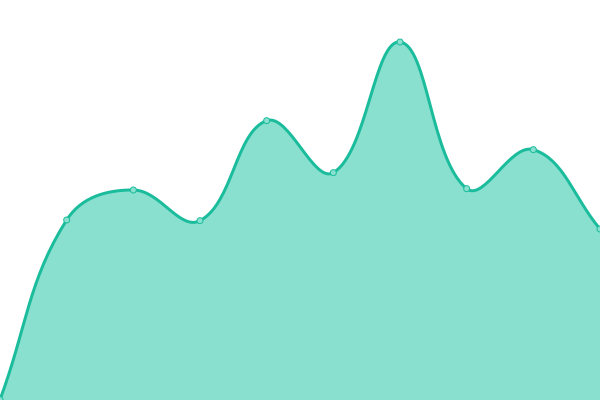
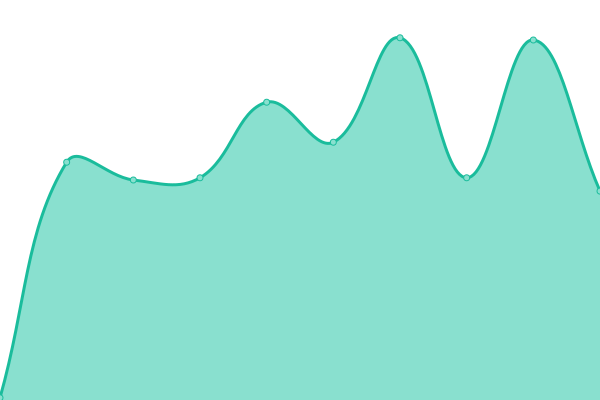

# [📈 Live Status](https://theswissbay.github.io/status): <!--live status--> **🟧 Partial outage**

This repository contains the open-source uptime monitor and status page for [theswissbay](https://theswissbay.github.io/status), powered by [Upptime](https://github.com/upptime/upptime).

With [Upptime](https://upptime.js.org), you can get your own unlimited and free uptime monitor and status page, powered entirely by a GitHub repository. We use [Issues](https://github.com/theswissbay/status/issues) as incident reports, [Actions](https://github.com/theswissbay/status/actions) as uptime monitors, and [Pages](https://theswissbay.github.io/status) for the status page.

<!--start: status pages-->
<!-- This summary is generated by Upptime (https://github.com/upptime/upptime) -->
<!-- Do not edit this manually, your changes will be overwritten -->
<!-- prettier-ignore -->
| URL | Status | History | Response Time | Uptime |
| --- | ------ | ------- | ------------- | ------ |
|  [Website](https://theswissbay.ch/) | 🟥 Down | [website.yml](https://github.com/theswissbay/status/commits/HEAD/history/website.yml) | 

 2770ms
     
 | 

<a href="https://theswissbay.github.io/status/history/website">96.98%</a>
    

|  [PDF archive](https://theswissbay.ch/pdf/changelog.html) | 🟥 Down | [pdf-archive.yml](https://github.com/theswissbay/status/commits/HEAD/history/pdf-archive.yml) | 

 2895ms
     
 | 

<a href="https://theswissbay.github.io/status/history/pdf-archive">97.27%</a>
    

|  [Arch Linux mirror](https://theswissbay.ch/archlinux/lastupdate) | 🟥 Down | [arch-linux-mirror.yml](https://github.com/theswissbay/status/commits/HEAD/history/arch-linux-mirror.yml) | 

 1204ms
     
 | 

<a href="https://theswissbay.github.io/status/history/arch-linux-mirror">98.16%</a>
    

|  [4id](https://fourid.theswissbay.ch/) | 🟥 Down | [4id.yml](https://github.com/theswissbay/status/commits/HEAD/history/4id.yml) | 

 3058ms
     
 | 

<a href="https://theswissbay.github.io/status/history/4id">97.34%</a>
    

|  [GitLab](https://gitlab.theswissbay.ch/users/sign_in) | 🟥 Down | [git-lab.yml](https://github.com/theswissbay/status/commits/HEAD/history/git-lab.yml) | 

 2927ms
     
 | 

<a href="https://theswissbay.github.io/status/history/git-lab">97.42%</a>
    

|  [GitLab SSH](81.6.2.165) | 🟩 Up | [git-lab-ssh.yml](https://github.com/theswissbay/status/commits/HEAD/history/git-lab-ssh.yml) | 

 136ms
     
 | 

<a href="https://theswissbay.github.io/status/history/git-lab-ssh">100.00%</a>
    

<!--end: status pages-->

[**Visit our status website →**](https://theswissbay.github.io/status)

## 📄 License

- Powered by: [Upptime](https://github.com/upptime/upptime)
- Code: [MIT](./LICENSE) © [theswissbay](https://theswissbay.github.io/status)
- Data in the `./history` directory: [Open Database License](https://opendatacommons.org/licenses/odbl/1-0/)
